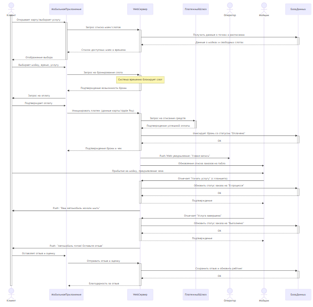
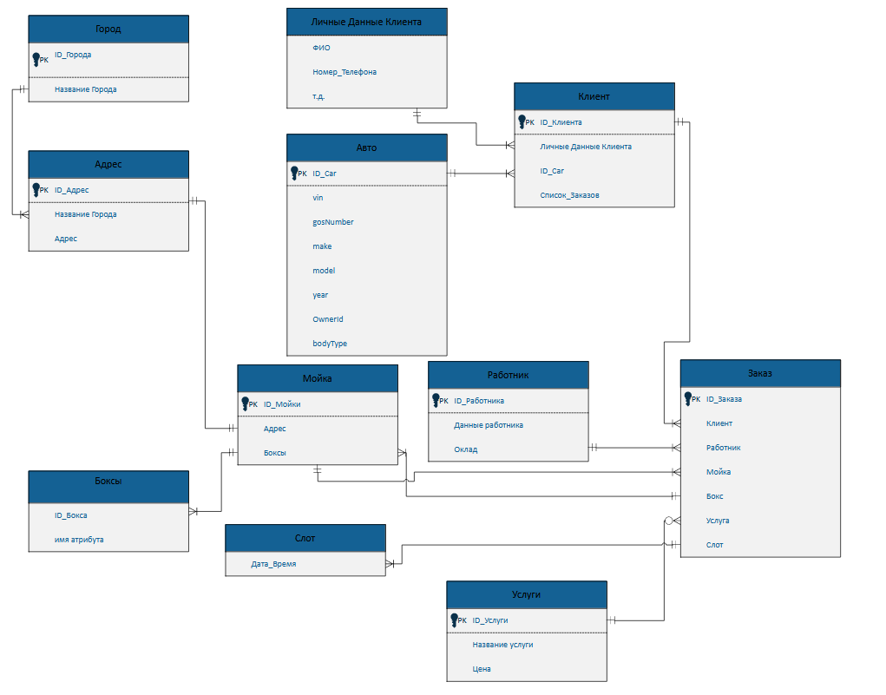
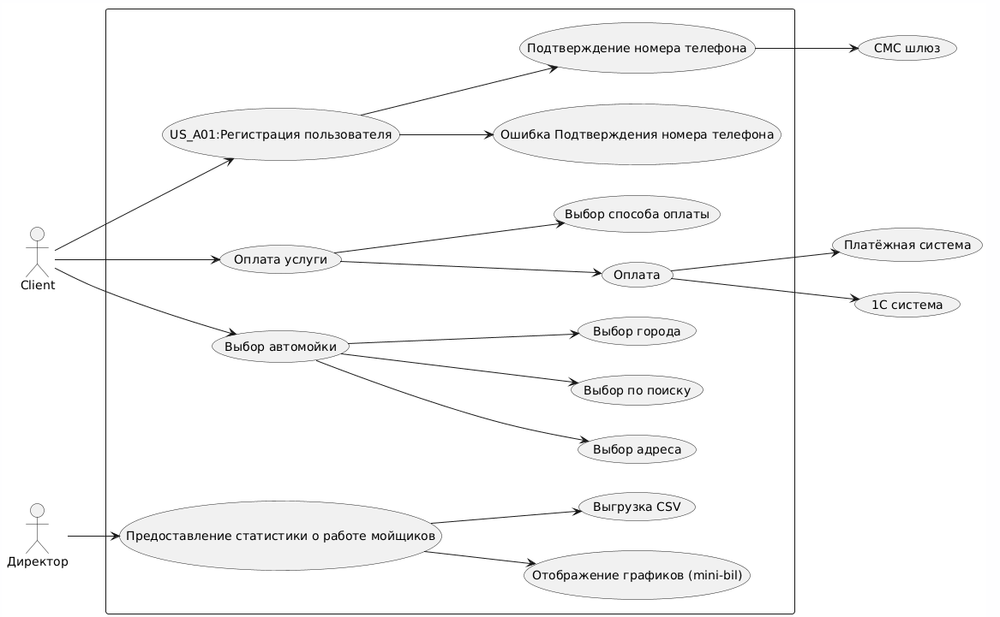
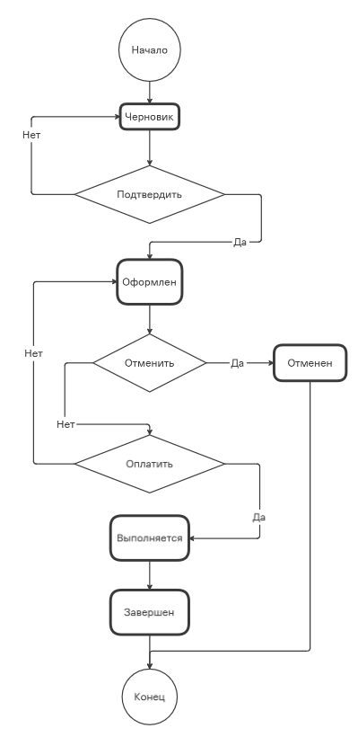

# 🚗 AUTOMOBILE Project

**Учебный проект по курсу "Интеграция информационных систем"**

---

## 📋 Оглавление

- [Описание проекта](#-описание-проекта)
- [Структура проекта](#-структура-проекта)
- [Документация](#-документация)

## 🎯 Описание проекта

Проект представляет собой систему управления сетью автомоек, включающую функционал для клиентов, сотрудников и администраторов. Система обеспечивает полный цикл обслуживания - от выбора услуги до оплаты и анализа статистики.

## 📁 Структура проекта

### 📊 Документация и диаграммы

| № | Компонент | Описание | Файлы |
|---|-----------|----------|-------|
| **1** | **Требования** | Функциональные и нефункциональные требования | [`Требования.md`](./Требования.md) |
| **2** | **Диаграмма последовательности** | Взаимодействие компонентов системы | [`Sequence Diagram.md`](./automoika-sequence-diagram.mmd)    |
| **3** | **ERD диаграмма** | Модель данных и отношения сущностей | [`ERD.md`](./Схема%20ERD.md)    |
| **4** | **UseCase диаграмма** | Прецеденты использования системы | [`UseCase_UML.md`](./UseCase_UML)    |
| **5** | **User Story** | Пользовательские сценарии | [`User_story.md`](./docs/UserStories.md) |
| **6** | **Status Model** | Модель статусов заказов |  |
| **7** | **OpenAPI спецификация** | API документация | [`Open API Code - OpenAPI.JSON`](./OpenAPI.json) |
| **8.1** | **C4 part 1** | C4  |  |
| **8.2** | **C4 part 2** | C4  |  |
